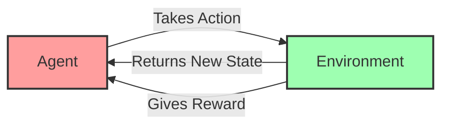

# Lesson 1: Foundations of Reinforcement Learning

##  Introduction to Reinforcement Learning

Reinforcement Learning (RL) is a type of machine learning where an **agent** learns to make decisions by taking actions in an **environment** to maximize some notion of **reward**.

Think of it like training a dog:
- When the dog does something good, you give it a treat (positive reward)
- When it does something bad, you might scold it (negative reward)
- The dog learns which behaviors lead to treats and which don't

In reinforcement learning, the computer is the dog, and it learns by trying different actions and seeing what happens!

## 🔵 Key Components of Reinforcement Learning

### Agent
- The learner or decision-maker
- Example: A robot, a character in a game, or a program that controls a system

### Environment
- The world in which the agent exists and operates
- Example: A game board, a physical space, or a simulation

### State
- The current situation of the agent in the environment
- Example: The position of a robot, the arrangement of pieces on a game board

### Action
- What the agent can do
- Example: Moving left/right, jumping, placing a game piece

### Reward
- Feedback from the environment
- Tells the agent how good or bad its action was
- Example: Points in a game, completing a task, or failing at something

## 🟢 The Reinforcement Learning Loop



1. The agent observes the current state of the environment
2. Based on this state, the agent takes an action
3. The environment changes to a new state
4. The environment gives the agent a reward
5. The agent uses this information to improve its decision-making
6. This process repeats!

## 🟣 Markov Decision Processes (MDPs)

Reinforcement learning problems are often described using MDPs. Don't worry if this sounds technical - the concept is simple!

An MDP is a mathematical framework that helps us describe the RL problem:

- **S**: Set of all possible states
- **A**: Set of all possible actions
- **P**: Probability of moving from one state to another when taking an action
- **R**: Reward function that defines the reward for each state-action pair
- **γ** (gamma): Discount factor - makes future rewards less valuable than immediate ones

## 🟡 Value Functions and Policies

### Value Functions
- Tell us how good it is to be in a certain state
- Help the agent decide which states to aim for

### Policy (π)
- The agent's strategy or behavior
- Maps states to actions - "In state X, I should do action Y"
- The ultimate goal is to find the optimal policy (the best strategy)

## 🟠 Key Algorithms

### 1. Dynamic Programming
- Requires complete knowledge of the environment
- Breaks down complex problems into simpler subproblems
- Used when we know all the rules (like in chess)

### 2. Monte Carlo Methods
- Learn from complete episodes of experience
- Don't require complete knowledge of the environment
- Great for games where we only know if we won or lost at the end

### 3. Temporal Difference (TD) Learning
- Learn from parts of episodes
- Update estimates based on other estimates (bootstrap)
- Popular algorithms: Q-learning and SARSA

## 🔴 Q-Learning: A Simple Example

Q-learning is one of the most popular RL algorithms. Here's a simplified view:

1. Create a Q-table (a table of state-action values)
2. For each state-action pair (s,a), initialize Q(s,a) to 0
3. For each episode:
   - Start in a random state
   - While not in a terminal state:
     - Choose an action (either explore or exploit)
     - Observe reward and new state
     - Update Q-value using: Q(s,a) = Q(s,a) + α[R + γ·max Q(s',a') - Q(s,a)]
     - Move to the new state
4. The final Q-table gives us the optimal policy!

## 🟦 Exploration vs. Exploitation

A key challenge in RL is balancing:
- **Exploration**: Trying new actions to discover better rewards
- **Exploitation**: Using what you already know works well

If you only exploit, you might miss better solutions.
If you only explore, you won't use what you've learned!

Common approach: Epsilon-greedy strategy
- Choose the best action most of the time (exploit)
- Sometimes choose a random action (explore)
- Reduce the randomness over time

## 🟧 Practical Example: GridWorld

Imagine a simple grid where:
- An agent starts at position S
- The goal is to reach position G
- There are walls (black) that can't be crossed
- Each step gives a small negative reward (-1)
- Reaching the goal gives a large positive reward (+100)

```
+---+---+---+---+
| S |   |   |   |
+---+---+---+---+
|   | 🧱 | 🧱 |   |
+---+---+---+---+
|   |   | 🧱 |   |
+---+---+---+---+
|   |   |   | G |
+---+---+---+---+
```

The agent will learn to find the shortest path to G by trying different routes and learning from the rewards!

## 💻 Simple Q-Learning Code Example

```python
# Very simple Q-learning implementation for GridWorld
import numpy as np

# Create a 4x4 grid environment
n_states = 16  # 4x4 grid
n_actions = 4  # up, right, down, left

# Initialize Q-table with zeros
Q = np.zeros((n_states, n_actions))

# Learning parameters
alpha = 0.1  # learning rate
gamma = 0.9  # discount factor
epsilon = 0.1  # exploration rate

# Training loop (simplified)
for episode in range(1000):
    state = 0  # start state
    done = False
    
    while not done:
        # Choose action (epsilon-greedy)
        if np.random.uniform(0, 1) < epsilon:
            action = np.random.choice(n_actions)  # explore
        else:
            action = np.argmax(Q[state])  # exploit
        
        # Take action and observe new state and reward
        # (In a real implementation, this would interact with the environment)
        # This is simplified:
        next_state = get_next_state(state, action)
        reward = get_reward(state, action)
        
        # Update Q-value
        best_next_action = np.argmax(Q[next_state])
        td_target = reward + gamma * Q[next_state, best_next_action]
        td_error = td_target - Q[state, action]
        Q[state, action] += alpha * td_error
        
        # Move to next state
        state = next_state
        
        # Check if episode is done
        if is_terminal_state(state):
            done = True
```

## 📚 Summary

In this lesson, we've covered:
- The basic components of reinforcement learning
- How agents interact with environments
- Markov Decision Processes
- Value functions and policies
- Basic algorithms like Dynamic Programming, Monte Carlo methods, and TD learning
- The exploration vs. exploitation dilemma
- A simple example with GridWorld

## 🏆 Practice Exercise

1. Create a simple 3x3 GridWorld environment
2. Implement the Q-learning algorithm from scratch
3. Train your agent to find the optimal path from the starting position to the goal
4. Experiment with different values of alpha, gamma, and epsilon
5. Visualize how the policy improves over time

## 📝 Next Lesson Preview

In the next lesson, we'll dive into Deep Reinforcement Learning, where we'll use neural networks to handle more complex environments with large state spaces!
