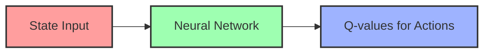
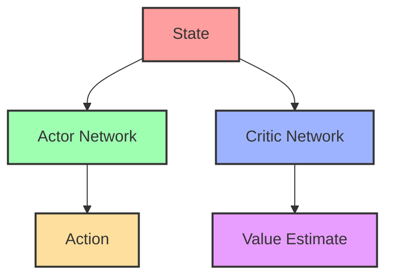

# Lesson 2: Deep Reinforcement Learning

##  Introduction to Deep Reinforcement Learning

Deep Reinforcement Learning (Deep RL) combines reinforcement learning with deep neural networks. This powerful combination helps us solve problems that have many states - too many for traditional RL methods!

In Lesson 1, we learned about Q-tables, which store values for each state-action pair. But what if we have:
- A game with millions of possible board positions?
- A robot that sees the world through a camera?
- A self-driving car with countless scenarios?

We can't make a table that big! This is where deep learning comes in - we use neural networks to estimate our value functions.

## 🔵 Neural Networks for Reinforcement Learning

### What is a Neural Network?

A neural network is a computing system inspired by the human brain. It can learn patterns from data and make predictions.

```
Input Layer → Hidden Layers → Output Layer
```

In Deep RL, neural networks can:
1. Take state information as input
2. Process it through hidden layers
3. Output value predictions or action probabilities

### Function Approximation

Instead of storing every state-action value in a table, we can use a neural network to approximate the function:
- Input: State (or state-action pair)
- Output: Value prediction

This is called **function approximation**, and it allows us to handle very large state spaces!

## 🟢 Deep Q-Networks (DQN)

Deep Q-Network (DQN) is a breakthrough algorithm that successfully combined deep learning with Q-learning.

### How DQN Works:

1. Use a neural network to estimate Q-values
2. Input: State representation
3. Output: Q-values for each possible action



### Key Innovations in DQN:

#### 1. Experience Replay
- Store experiences (state, action, reward, next state) in a replay buffer
- Train the network on random samples from this buffer
- This breaks correlations between sequential experiences
- Helps the network learn more efficiently

#### 2. Target Network
- Maintain two networks: the main network and a target network
- The target network is used to calculate target Q-values
- Update the target network periodically (copying weights from the main network)
- This makes training more stable

### Basic DQN Algorithm:
1. Initialize replay memory D
2. Initialize Q-network with random weights
3. Initialize target Q-network with same weights
4. For each episode:
   - Observe initial state s
   - For each step:
     - Choose action a (using epsilon-greedy policy)
     - Take action a, observe reward r and next state s'
     - Store experience (s, a, r, s') in replay memory D
     - Sample random batch from D
     - Calculate target values using target network
     - Update Q-network weights
     - Every C steps, update target network

## 🟣 DQN Variants and Improvements

Several improvements to DQN have been developed:

### Double DQN
- Problem: DQN tends to overestimate Q-values
- Solution: Use one network to select the best action and another to evaluate it
- Result: More accurate value estimates and better performance

### Dueling DQN
- Splits the Q-value into two parts:
  - Value of being in a state (V)
  - Advantage of taking each action (A)
- Better at identifying which states are valuable regardless of actions

### Prioritized Experience Replay
- Not all experiences are equally valuable for learning
- Give priority to experiences with large prediction errors
- Sample more important experiences more frequently

## 🟡 Policy Gradient Methods

While DQN learns a value function, policy gradient methods directly learn the policy.

### Key Concepts:

#### Policy Function
- Directly maps states to actions (or action probabilities)
- Represented by a neural network with parameters θ

#### Objective Function
- Goal: Maximize expected reward
- J(θ) = Expected sum of rewards when following policy π_θ

#### Policy Gradient
- Update policy parameters in the direction that increases expected reward
- θ ← θ + α∇J(θ)

### REINFORCE Algorithm

A basic policy gradient method:

1. Initialize policy network with random weights θ
2. For each episode:
   - Collect trajectory (s₀, a₀, r₀, s₁, a₁, r₁, ...) by following policy
   - For each time step t:
     - Calculate return G_t (sum of discounted rewards)
     - Update policy parameters: θ ← θ + α∇log(π_θ(a_t|s_t))G_t

### Advantages and Challenges:

✅ Can learn stochastic policies  
✅ Can work in continuous action spaces  
❌ High variance in gradient estimates  
❌ Sample inefficient  

## 🟠 Actor-Critic Methods

Actor-Critic methods combine value-based and policy-based approaches.

### Components:

#### Actor
- Policy network that decides which actions to take
- Updated using policy gradient

#### Critic
- Value network that evaluates the actor's actions
- Helps reduce variance in policy updates



### Advantage Actor-Critic (A2C)

Improves on basic Actor-Critic by using advantage function:
- Advantage = Q(s,a) - V(s)
- Measures how much better an action is compared to average

## 🔴 Proximal Policy Optimization (PPO)

PPO is one of the most popular and effective Deep RL algorithms.

### Key Idea:
- Make policy updates that improve performance
- But don't change the policy too much at once
- Balance exploration and exploitation

### How PPO Works:
1. Collect experiences using current policy
2. Compute advantage estimates
3. Update policy using objective function with clipping
4. The clipping prevents too large policy changes

### Advantages:
- Simpler to implement than many alternatives
- Good performance across many tasks
- More stable training
- Used in many real-world applications

## 🟦 Practical Implementation: Training an Agent to Play Atari Games

Let's see how Deep RL is applied to train an agent to play Atari games like Breakout or Pong.

### Setup:
1. Environment: Atari game via OpenAI Gym
2. State: Game screen pixels (resized and preprocessed)
3. Actions: Game controls (joystick movements)
4. Reward: Game score

### Implementation Steps:

#### 1. Preprocessing
- Convert images to grayscale
- Resize to smaller dimensions (e.g., 84x84)
- Stack multiple frames to capture motion

#### 2. Network Architecture
- Convolutional layers to process images
- Fully connected layers to produce Q-values

```python
# Example DQN architecture for Atari (simplified)
import torch.nn as nn

class DQN(nn.Module):
    def __init__(self, n_actions):
        super(DQN, self).__init__()
        
        # Convolutional layers
        self.conv = nn.Sequential(
            nn.Conv2d(4, 32, kernel_size=8, stride=4),
            nn.ReLU(),
            nn.Conv2d(32, 64, kernel_size=4, stride=2),
            nn.ReLU(),
            nn.Conv2d(64, 64, kernel_size=3, stride=1),
            nn.ReLU()
        )
        
        # Fully connected layers
        self.fc = nn.Sequential(
            nn.Linear(7 * 7 * 64, 512),
            nn.ReLU(),
            nn.Linear(512, n_actions)
        )
        
    def forward(self, x):
        conv_out = self.conv(x)
        conv_out = conv_out.view(conv_out.size(0), -1)
        return self.fc(conv_out)
```

#### 3. Training Loop
- Use experience replay and target network
- Train for millions of steps
- Gradually decrease exploration rate

## 🟧 Common Deep RL Frameworks and Tools

### Libraries and Frameworks:
- **PyTorch**: Flexible deep learning framework
- **TensorFlow**: Popular ML framework with good RL support
- **Stable Baselines3**: High-level RL library with pre-implemented algorithms
- **RLlib**: Scalable RL library for distributed training

### Environments:
- **OpenAI Gym**: Standard interface for RL environments
- **DeepMind Control Suite**: Physics-based control tasks
- **Unity ML-Agents**: Train agents in Unity game engine
- **PyBullet**: Physics simulation for robotics

## 💻 Example: DQN with PyTorch and Gym

Here's a simplified implementation of DQN for the CartPole environment:

```python
import gym
import numpy as np
import torch
import torch.nn as nn
import torch.optim as optim
import random
from collections import deque

# Simple DQN Network
class DQN(nn.Module):
    def __init__(self, input_size, output_size):
        super(DQN, self).__init__()
        self.fc = nn.Sequential(
            nn.Linear(input_size, 128),
            nn.ReLU(),
            nn.Linear(128, 128),
            nn.ReLU(),
            nn.Linear(128, output_size)
        )
        
    def forward(self, x):
        return self.fc(x)

# Replay Buffer
class ReplayBuffer:
    def __init__(self, capacity):
        self.buffer = deque(maxlen=capacity)
    
    def push(self, state, action, reward, next_state, done):
        self.buffer.append((state, action, reward, next_state, done))
    
    def sample(self, batch_size):
        return random.sample(self.buffer, batch_size)
    
    def __len__(self):
        return len(self.buffer)

# Training parameters
BATCH_SIZE = 128
GAMMA = 0.99
EPSILON_START = 1.0
EPSILON_END = 0.01
EPSILON_DECAY = 0.001
TARGET_UPDATE = 10
MEMORY_SIZE = 10000
LR = 0.001

# Environment setup
env = gym.make('CartPole-v1')
n_states = env.observation_space.shape[0]
n_actions = env.action_space.n

# Initialize networks and optimizer
policy_net = DQN(n_states, n_actions)
target_net = DQN(n_states, n_actions)
target_net.load_state_dict(policy_net.state_dict())
target_net.eval()

optimizer = optim.Adam(policy_net.parameters(), lr=LR)
memory = ReplayBuffer(MEMORY_SIZE)
steps_done = 0

# Select action with epsilon-greedy policy
def select_action(state, epsilon):
    if random.random() < epsilon:
        return random.randrange(n_actions)
    else:
        with torch.no_grad():
            state_tensor = torch.FloatTensor(state)
            q_values = policy_net(state_tensor)
            return q_values.argmax().item()

# Training loop
num_episodes = 500
for episode in range(num_episodes):
    state = env.reset()
    done = False
    total_reward = 0
    
    while not done:
        # Calculate epsilon and select action
        epsilon = EPSILON_END + (EPSILON_START - EPSILON_END) * \
                 np.exp(-steps_done * EPSILON_DECAY)
        action = select_action(state, epsilon)
        steps_done += 1
        
        # Take action and observe new state
        next_state, reward, done, _ = env.step(action)
        total_reward += reward
        
        # Store transition in memory
        memory.push(state, action, reward, next_state, done)
        state = next_state
        
        # Perform one step of optimization
        if len(memory) >= BATCH_SIZE:
            # Sample mini-batch
            transitions = memory.sample(BATCH_SIZE)
            batch = list(zip(*transitions))
            
            # Create tensors for each element
            state_batch = torch.FloatTensor(batch[0])
            action_batch = torch.LongTensor(batch[1]).unsqueeze(1)
            reward_batch = torch.FloatTensor(batch[2]).unsqueeze(1)
            next_state_batch = torch.FloatTensor(batch[3])
            done_batch = torch.FloatTensor(batch[4]).unsqueeze(1)
            
            # Compute Q(s_t, a) - the model computes Q(s_t), then we select the
            # columns of actions taken
            state_action_values = policy_net(state_batch).gather(1, action_batch)
            
            # Compute V(s_{t+1}) for all next states
            next_state_values = torch.zeros(BATCH_SIZE, 1)
            with torch.no_grad():
                next_state_values = target_net(next_state_batch).max(1)[0].unsqueeze(1)
            
            # Compute the expected Q values
            expected_state_action_values = reward_batch + GAMMA * next_state_values * (1 - done_batch)
            
            # Compute Huber loss
            loss = nn.SmoothL1Loss()(state_action_values, expected_state_action_values)
            
            # Optimize the model
            optimizer.zero_grad()
            loss.backward()
            for param in policy_net.parameters():
                param.grad.data.clamp_(-1, 1)
            optimizer.step()
    
    # Update the target network every TARGET_UPDATE episodes
    if episode % TARGET_UPDATE == 0:
        target_net.load_state_dict(policy_net.state_dict())
    
    print(f"Episode {episode}, Total Reward: {total_reward}")
```

## 📚 Summary

In this lesson, we covered:
- How neural networks can approximate value functions and policies
- Deep Q-Networks (DQN) and their key innovations
- Improvements to DQN (Double DQN, Dueling DQN, Prioritized Replay)
- Policy Gradient methods and the REINFORCE algorithm
- Actor-Critic methods
- Proximal Policy Optimization (PPO)
- Practical implementation for Atari games
- Tools and frameworks for Deep RL

## 🏆 Practice Exercise

1. Set up a Deep RL environment with OpenAI Gym and PyTorch/TensorFlow
2. Implement a simple DQN agent for the CartPole environment
3. Experiment with different hyperparameters and network architectures
4. Try implementing one DQN improvement (Double DQN, Dueling DQN, or Prioritized Replay)
5. Compare the performance of your improved agent with the basic DQN

## 📝 Next Lesson Preview

In the next and final lesson, we'll explore advanced topics in reinforcement learning, including:
- Multi-agent reinforcement learning
- Hierarchical RL
- Meta-learning and transfer learning
- Real-world applications
- Current research trends and future directions
