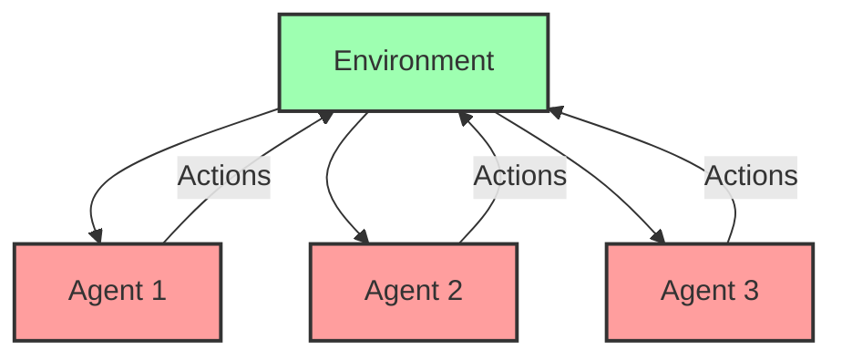
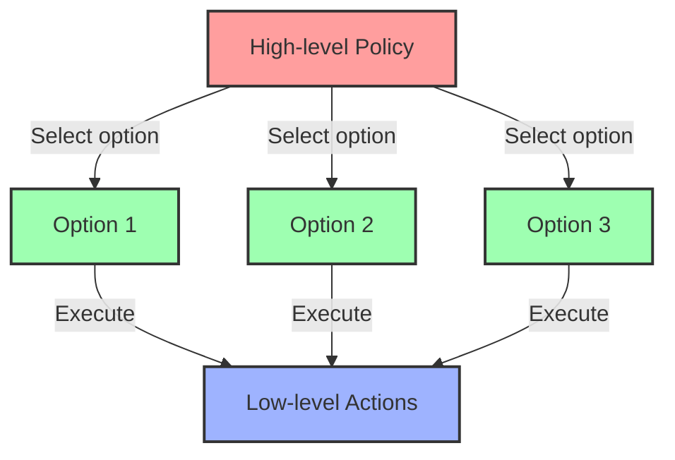

# Lesson 3: Advanced Topics and Applications in Reinforcement Learning

##  Introduction to Advanced Reinforcement Learning

Welcome to the final lesson in our Reinforcement Learning course! In the previous lessons, we covered the foundations of RL and deep RL techniques. Now, we'll explore cutting-edge topics and real-world applications that show the true power of reinforcement learning.

This lesson will introduce you to multi-agent systems, hierarchical approaches, meta-learning, and practical applications that are changing industries today. We'll also look at current research trends that will shape the future of RL.

## 🔵 Multi-Agent Reinforcement Learning (MARL)

### What is Multi-Agent RL?

Multi-Agent Reinforcement Learning involves multiple agents learning simultaneously in a shared environment. Each agent has its own goals, but their actions affect each other and the environment.



### Key Challenges in MARL:

1. **Non-stationarity**: The environment changes as other agents learn
2. **Coordination**: Agents need to work together for common goals
3. **Credit assignment**: Determining which agent contributed to success
4. **Scalability**: Managing complexity with many agents

### MARL Settings:

#### Cooperative
- Agents share the same reward function
- Goal is to maximize team performance
- Example: Robot soccer team, warehouse robots

#### Competitive
- Agents have opposing goals
- One agent's gain is another's loss
- Example: Chess, poker, strategy games

#### Mixed
- Combination of cooperation and competition
- Example: Team sports, trading markets

### Popular MARL Algorithms:

#### Independent Q-Learning (IQL)
- Each agent learns its own Q-function
- Simple but ignores interactions between agents

#### Multi-Agent Deep Deterministic Policy Gradient (MADDPG)
- Extension of DDPG for multi-agent settings
- Centralized training with decentralized execution

#### Counterfactual Multi-Agent Policy Gradients (COMA)
- Uses a centralized critic to estimate advantages
- Helps with credit assignment problem

## 🟢 Hierarchical Reinforcement Learning

### The Problem with Flat RL

Traditional RL algorithms treat all decisions equally, but real problems often have structure:
- Some decisions are made frequently (low-level)
- Others are made occasionally (high-level)
- Many tasks have natural subtasks

Hierarchical RL addresses these issues by organizing decision-making at multiple levels.

### Key Concepts in Hierarchical RL:

#### Temporal Abstraction
- Group sequences of actions into higher-level "options"
- An option is a policy with start and termination conditions
- Helps agents reason at different time scales

#### Options Framework
- Three components:
  1. Policy: How to act when following this option
  2. Initiation set: When can this option be started
  3. Termination condition: When does this option end



#### Feudal Networks
- Organize policies in a hierarchical structure
- Higher levels set goals for lower levels
- Lower levels learn how to achieve those goals

### Benefits of Hierarchical RL:
- Better exploration
- Transfer learning between tasks
- More efficient learning
- More interpretable policies

## 🟣 Meta-Learning and Transfer Learning

### What is Meta-Learning?

Meta-learning is "learning to learn" - training systems that can adapt quickly to new tasks using experience from previous tasks.

#### Key Idea:
- Instead of learning a specific task
- Learn how to learn new tasks efficiently

### Meta-RL Approaches:

#### Model-Agnostic Meta-Learning (MAML)
- Find initial model parameters that can adapt quickly to new tasks
- Few-shot learning for RL

#### Recurrent Policies
- Use recurrent neural networks to store task information
- RNN's internal state adapts to the current task

### Transfer Learning in RL

Transfer learning applies knowledge from source tasks to improve learning in target tasks.

#### Methods:
1. **Policy transfer**: Reuse policies from similar tasks
2. **Feature transfer**: Reuse learned representations
3. **Instance transfer**: Reuse experiences from source tasks

#### Benefits:
- Faster learning on new tasks
- Better generalization
- More efficient use of experience

## 🟡 Deep Reinforcement Learning for Robotics

Robotics is one of the most promising application areas for RL. Let's explore how Deep RL is being used in this field.

### Challenges in Robot Learning:

1. **Sample efficiency**: Real robots can't run millions of trials
2. **Safety**: Exploration can damage robots or environment
3. **Reality gap**: Sim-to-real transfer is difficult
4. **Partial observability**: Robots have limited sensors

### Approaches to Robot Learning:

#### Sim-to-Real Transfer
- Train policies in simulation
- Add noise and randomization to make policies robust
- Fine-tune on real robot with fewer samples

#### Imitation Learning
- Learn from human demonstrations
- Behavioral cloning: directly mimic demonstrated actions
- Inverse RL: infer the reward function from demonstrations

#### Model-Based RL for Robotics
- Learn a model of the robot's dynamics
- Use the model to plan actions
- Requires fewer real-world samples

### Successful Applications:
- Robot manipulation (grasping, assembly)
- Legged locomotion
- Drone control
- Autonomous driving

## 🟠 RL in Recommendation Systems

Recommendation systems are a major commercial application of RL.

### The RL Formulation:

- **State**: User history, context, available items
- **Actions**: Items to recommend
- **Reward**: Clicks, purchases, watch time, etc.

### Challenges:
- Vast action spaces (millions of items)
- Delayed rewards (purchase may happen days later)
- Exploration vs. exploitation trade-off
- Cold start problem for new users/items

### Solutions:
- Use contextual bandits as a simplified RL approach
- Deep Q-networks with action embeddings
- Actor-critic methods with item embeddings

### Real-World Examples:
- YouTube video recommendations
- Netflix movie recommendations
- Spotify playlist generation
- Amazon product recommendations

## 🔴 RL in Healthcare

Reinforcement learning has promising applications in medicine and healthcare.

### Applications:

#### Treatment Planning
- Optimize treatment strategies for chronic diseases
- Learn from historical patient data
- Personalize treatment based on patient characteristics

#### Clinical Trials
- Adaptive clinical trial design
- Optimize dosage and treatment combinations

#### Resource Allocation
- Optimize hospital resources
- Emergency room management
- Operating room scheduling

### Challenges:
- Limited data
- Safety concerns
- Interpretability requirements
- Regulatory hurdles

### Approaches:
- Off-policy learning from historical data
- Conservative policy updates
- Uncertainty-aware methods
- Explainable RL models

## 🟦 RL in Finance

Financial markets provide rich environments for RL applications.

### Trading and Investment:
- Automated trading strategies
- Portfolio optimization
- Risk management

### Formulation:
- **State**: Market data, technical indicators, news
- **Actions**: Buy, sell, hold decisions
- **Reward**: Returns, Sharpe ratio, etc.

### Challenges:
- Non-stationarity of markets
- Partial observability
- Low signal-to-noise ratio
- Risk management

### Approaches:
- Ensemble methods for robustness
- Risk-sensitive RL
- Multi-agent simulations
- Incorporating domain knowledge

## 🟧 Current Research Trends

The field of RL is rapidly evolving. Here are some important research directions:

### 1. Sample Efficiency
Making RL algorithms learn from fewer experiences:
- Model-based RL
- Off-policy learning
- Data augmentation techniques
- Self-supervised learning

### 2. Exploration Strategies
Developing better ways to explore environments:
- Curiosity-driven exploration
- Information gain exploration
- Goal exploration processes
- Planning-based exploration

### 3. Safety and Robustness
Ensuring RL systems act safely and reliably:
- Constrained RL
- Risk-sensitive RL
- Robust RL
- Human-in-the-loop RL

### 4. Causal RL
Incorporating causal reasoning into RL:
- Counterfactual reasoning
- Causal discovery
- Invariant policy learning

### 5. Foundation Models for RL
Building general-purpose RL systems:
- Pre-trained representations
- Multi-task learning
- World models
- Decision transformers

## 💻 Example Project: Traffic Signal Control

Let's look at a simplified example of applying RL to traffic signal control:

```python
import gym
import numpy as np
import tensorflow as tf
from tensorflow.keras import layers
from collections import deque
import random

# Custom environment for traffic signal control (simplified)
class TrafficSignalEnv(gym.Env):
    def __init__(self):
        super(TrafficSignalEnv, self).__init__()
        # Two actions: keep current phase or change phase
        self.action_space = gym.spaces.Discrete(2)
        # State: queue lengths for each lane (4 lanes) + current phase
        self.observation_space = gym.spaces.Box(low=0, high=50, shape=(5,))
        self.state = np.zeros(5)
        self.max_steps = 100
        self.current_step = 0
        
    def reset(self):
        # Reset queue lengths and phase
        self.state = np.array([
            random.randint(0, 10),  # North queue
            random.randint(0, 10),  # East queue
            random.randint(0, 10),  # South queue
            random.randint(0, 10),  # West queue
            0  # Current phase (0: N-S green, 1: E-W green)
        ])
        self.current_step = 0
        return self.state
    
    def step(self, action):
        # Update phase if action is 1
        if action == 1:
            self.state[4] = 1 - self.state[4]  # Toggle phase
            
        # Simulate traffic flow
        if self.state[4] == 0:  # N-S green
            # North and South queues decrease
            self.state[0] = max(0, self.state[0] - 3)
            self.state[2] = max(0, self.state[2] - 3)
            # East and West queues increase
            self.state[1] = min(50, self.state[1] + random.randint(0, 2))
            self.state[3] = min(50, self.state[3] + random.randint(0, 2))
        else:  # E-W green
            # East and West queues decrease
            self.state[1] = max(0, self.state[1] - 3)
            self.state[3] = max(0, self.state[3] - 3)
            # North and South queues increase
            self.state[0] = min(50, self.state[0] + random.randint(0, 2))
            self.state[2] = min(50, self.state[2] + random.randint(0, 2))
            
        # Calculate reward (negative sum of queue lengths)
        reward = -np.sum(self.state[:4])
        
        # Check if episode is done
        self.current_step += 1
        done = self.current_step >= self.max_steps
        
        return self.state, reward, done, {}

# Create model for deep Q-learning
def create_q_model(state_shape, action_shape):
    inputs = layers.Input(shape=state_shape)
    layer1 = layers.Dense(64, activation="relu")(inputs)
    layer2 = layers.Dense(64, activation="relu")(layer1)
    outputs = layers.Dense(action_shape)(layer2)
    
    return tf.keras.Model(inputs=inputs, outputs=outputs)

# Training parameters
gamma = 0.99
epsilon = 1.0
epsilon_min = 0.1
epsilon_decay = 0.995
batch_size = 64
memory = deque(maxlen=10000)

# Create environment and models
env = TrafficSignalEnv()
state_shape = env.observation_space.shape
action_shape = env.action_space.n

primary_network = create_q_model(state_shape, action_shape)
target_network = create_q_model(state_shape, action_shape)
target_network.set_weights(primary_network.get_weights())

optimizer = tf.keras.optimizers.Adam(learning_rate=0.001)

# Training loop
def train_traffic_agent(episodes=1000):
    rewards_history = []
    
    for episode in range(episodes):
        state = env.reset()
        episode_reward = 0
        done = False
        
        while not done:
            # Use epsilon-greedy for exploration
            if random.random() < epsilon:
                action = env.action_space.sample()
            else:
                state_tensor = tf.convert_to_tensor(state)
                state_tensor = tf.expand_dims(state_tensor, 0)
                q_values = primary_network(state_tensor)
                action = tf.argmax(q_values[0]).numpy()
            
            # Take action and observe next state and reward
            next_state, reward, done, _ = env.step(action)
            episode_reward += reward
            
            # Store experience in memory
            memory.append((state, action, reward, next_state, done))
            state = next_state
            
            # Train network if we have enough samples
            if len(memory) >= batch_size:
                # Sample batch from memory
                minibatch = random.sample(memory, batch_size)
                
                # Extract data
                states = np.array([experience[0] for experience in minibatch])
                actions = np.array([experience[1] for experience in minibatch])
                rewards = np.array([experience[2] for experience in minibatch])
                next_states = np.array([experience[3] for experience in minibatch])
                dones = np.array([experience[4] for experience in minibatch])
                
                # Q-learning update
                future_rewards = target_network.predict(next_states)
                target_q_values = rewards + gamma * np.max(future_rewards, axis=1) * (1 - dones)
                
                # Create target Q-values tensor
                masks = tf.one_hot(actions, action_shape)
                with tf.GradientTape() as tape:
                    q_values = primary_network(states)
                    q_values_for_actions = tf.reduce_sum(tf.multiply(q_values, masks), axis=1)
                    loss = tf.keras.losses.MSE(target_q_values, q_values_for_actions)
                
                # Backpropagation
                grads = tape.gradient(loss, primary_network.trainable_variables)
                optimizer.apply_gradients(zip(grads, primary_network.trainable_variables))
            
        # Update target network occasionally
        if episode % 10 == 0:
            target_network.set_weights(primary_network.get_weights())
        
        # Decay epsilon
        global epsilon
        if epsilon > epsilon_min:
            epsilon *= epsilon_decay
        
        rewards_history.append(episode_reward)
        
        if episode % 50 == 0:
            print(f"Episode: {episode}, Average Reward: {np.mean(rewards_history[-50:])}")
    
    return rewards_history

# Train the agent
# rewards = train_traffic_agent()  # Uncomment to run training
```

## 📚 Summary

In this final lesson, we explored advanced topics in reinforcement learning:

- **Multi-Agent RL**: Systems with multiple learners interacting
- **Hierarchical RL**: Organizing policies at different levels of abstraction
- **Meta-Learning**: Learning to learn and transfer knowledge between tasks
- **Applications**: How RL is being used in robotics, recommendations, healthcare, and finance
- **Research Trends**: Current directions in RL research
- **Example Project**: Traffic signal control using Deep RL

These advanced topics represent the frontier of RL research and application. As the field continues to evolve, we'll see even more powerful methods and applications emerge.

## 🏆 Final Project Ideas

To solidify your understanding of reinforcement learning, consider implementing one of these projects:

1. **Multi-Agent Game**: Implement a simple multi-agent environment (like Predator-Prey) and train cooperative or competitive agents

2. **Hierarchical Task**: Create a hierarchical RL agent for a complex task like robotic manipulation or navigation

3. **Real-World Application**: Apply RL to a practical problem like energy management, resource allocation, or scheduling

4. **Custom Environment**: Design your own RL environment based on a real-world problem you're interested in

5. **Comparative Study**: Implement multiple algorithms (DQN, PPO, SAC) and compare their performance on a benchmark task

## 🌟 Resources for Further Learning

### Books:
- "Reinforcement Learning: An Introduction" by Sutton & Barto
- "Deep Reinforcement Learning Hands-On" by Maxim Lapan
- "Algorithms for Reinforcement Learning" by Csaba Szepesvári

### Online Courses:
- DeepMind's Advanced Deep Learning & Reinforcement Learning
- UC Berkeley's Deep Reinforcement Learning course
- Stanford's CS234: Reinforcement Learning

### Research Papers:
- Keep up with latest papers on arXiv (Machine Learning section)
- Follow conferences like NeurIPS, ICML, ICLR

### Communities:
- r/reinforcementlearning on Reddit
- RL Discord servers
- GitHub repositories for popular RL libraries

## 🎉 Conclusion

Congratulations on completing our Reinforcement Learning course! You've now gained knowledge of the fundamentals, deep RL techniques, and advanced topics that represent the cutting edge of this exciting field.

Remember that reinforcement learning is a rapidly evolving area, with new techniques and applications emerging constantly. The best way to stay proficient is to keep learning, implementing, and experimenting with these powerful methods.

As you continue your RL journey, focus on:
1. Building intuition through practice
2. Understanding both theory and implementation
3. Keeping up with the latest research
4. Applying RL to problems you care about

Good luck with your future reinforcement learning projects!
